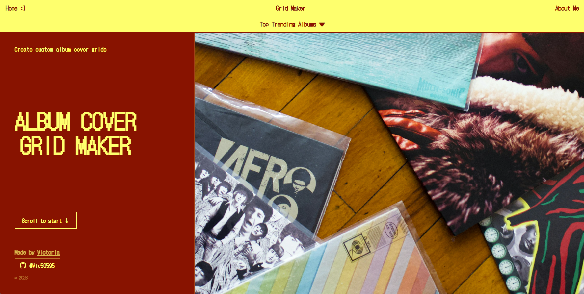
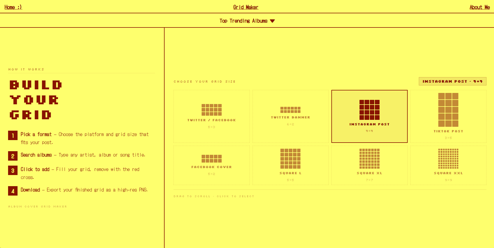
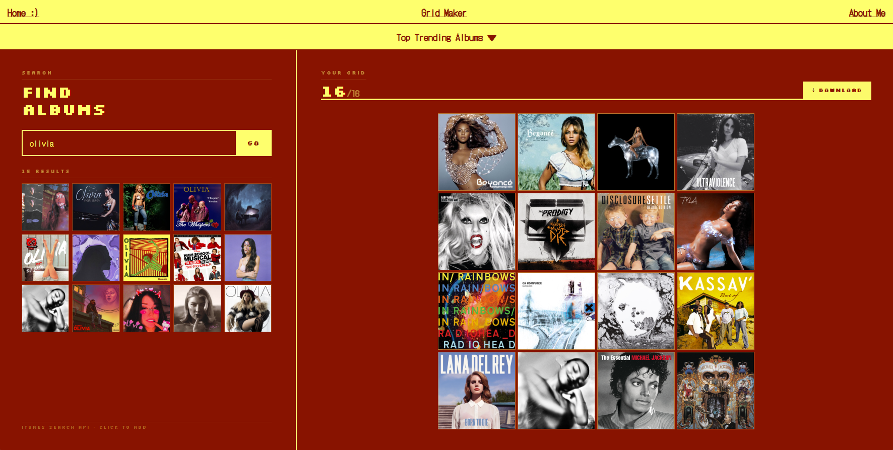
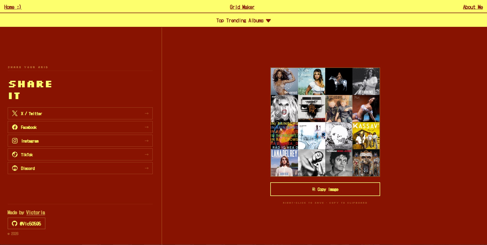
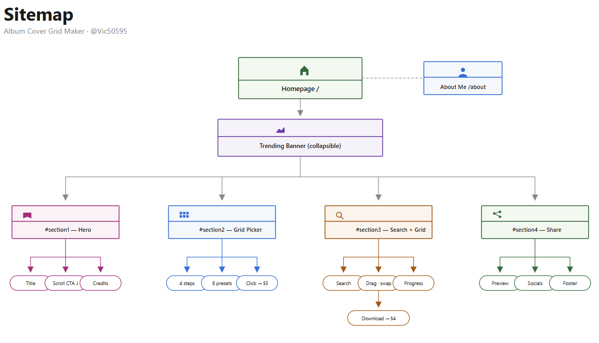

# Album Cover Grid Maker v2

> A web app to create and download custom album cover grids for social media — built with React + Vite.

[](https://reactjs.org/)
[](https://vitejs.dev/)
[](https://album-cover-grid-maker-v2.vercel.app)
[](https://opensource.org/licenses/MIT)

---


---

## 🌐 Live Demo

👉 **[album-cover-grid-maker-v2.vercel.app](https://album-cover-grid-maker-v2.vercel.app)**

---

## 📸 Screenshots

> _Grid size selector_



> _Search & browse album covers_




> _Export preview_



---

## ✨ Features

- 🔍 **Search** any artist or album via the iTunes Search API (no API key needed)
- 🔥 **Trending banner** — browse the top 50 albums by country (Belgium, US, France, UK, Japan…)
- 🗂️ **Pick a grid format** optimised for Twitter, Instagram, TikTok, Facebook, and more (8 presets)
- 🖱️ **Drag & drop** album covers from search results, trending banner, or directly within the grid
- 🔄 **Swap & reorder** — drag any cell in the grid onto another to swap them instantly
- 📥 **Export as high-res PNG** ready to share on social media
- 🔗 **One-click share** to Twitter, Facebook, or Pinterest
- 📱 Fully responsive — works on desktop and mobile

---

## 🛠️ Tech Stack

| Layer | Technology |
|-------|-----------|
| Framework | React 18 |
| Build tool | Vite 5 |
| Routing | React Router DOM v6 |
| Styling | CSS (custom, no UI library) |
| Drag & drop | Native HTML5 Drag and Drop API |
| Export | Canvas API (client-side PNG rendering) |
| API | [iTunes Search API](https://developer.apple.com/library/archive/documentation/AudioVideo/Conceptual/iTuneSearchAPI/) + iTunes RSS top albums |
| Deployment | Vercel |

---
## ✏️ Site Map



---

## 🚀 Getting Started

### Prerequisites

- Node.js **v18+**
- npm or yarn

### Installation

```bash
# 1. Clone the repository
git clone https://github.com/Vic50595/Album-Cover-Grid-Maker-v2.git

# 2. Navigate into the project folder
cd Album-Cover-Grid-Maker-v2

# 3. Install dependencies
npm install

# 4. Start the development server
npm run dev
```

The app will be running at `http://localhost:5173`.

### Available Scripts

| Command | Description |
|---------|-------------|
| `npm run dev` | Start the local development server |
| `npm run build` | Build the app for production |
| `npm run preview` | Preview the production build locally |

---

## 📁 Project Structure

```
Album-Cover-Grid-Maker-v2/
├── public/
│   └── images/              # Static assets
├── src/
│   ├── components/
│   │   ├── Navbar.jsx
│   │   ├── TrendingBanner.jsx
│   │   ├── GridSizeCarousel.jsx
│   │   ├── SearchPanel.jsx
│   │   ├── AlbumGrid.jsx
│   │   └── VinylSection.jsx
│   ├── pages/
│   │   ├── Home.jsx
│   │   └── AboutMe.jsx
│   ├── styles/              # Global + page CSS
│   ├── App.jsx              # Root component & routing
│   └── main.jsx             # App entry point
├── index.html
├── vite.config.js
└── package.json
```

---

## 🗺️ App Flow

1. **Trending banner** at the top — expand it to discover what's trending in any country, then drag an album straight onto your grid.
2. **Section 1 — Hero** — landing page with a scroll-to-start CTA.
3. **Section 2 — Grid Picker** — choose a format (Twitter post, IG square, TikTok vertical…). Clicking a size auto-scrolls to the search panel.
4. **Section 3 — Search + Grid** — search albums, click or drag them into slots, swap and reorder by dragging covers between slots. Hit Download when the grid is full.
5. **Section 4 — Share** — preview the exported grid and share it on social networks.

---

## 🔌 API

This app uses the **free** iTunes Search API — no authentication or API key required.

```
https://itunes.apple.com/search?term={query}&entity=album&limit=20
https://itunes.apple.com/{country}/rss/topalbums/limit=50/json
```

---

## 🗺️ Roadmap

- [x] ~~Custom grid sizes (Twitter, IG, TikTok, etc.)~~ ✅
- [x] ~~Drag-and-drop reordering within the grid~~ ✅
- [x] ~~Trending albums by country~~ ✅
- [ ] Dark / Light mode toggle
- [ ] Save grids as shareable links
- [ ] Support for Spotify API as an alternative data source
- [ ] User accounts to save and revisit grids

---

## 🤝 Contributing

Contributions, issues and feature requests are welcome!

1. Fork the repository
2. Create your feature branch: `git checkout -b feature/my-feature`
3. Commit your changes: `git commit -m 'Add my feature'`
4. Push to the branch: `git push origin feature/my-feature`
5. Open a Pull Request

---

## 👨‍💻 About the Author

Made with ❤️ by **[Vic50595](https://github.com/Vic50595)** — junior full-stack developer.

Feel free to ⭐ the repo if you find it useful!

---

## 📄 License

This project is open source and available under the [MIT License](LICENSE).
